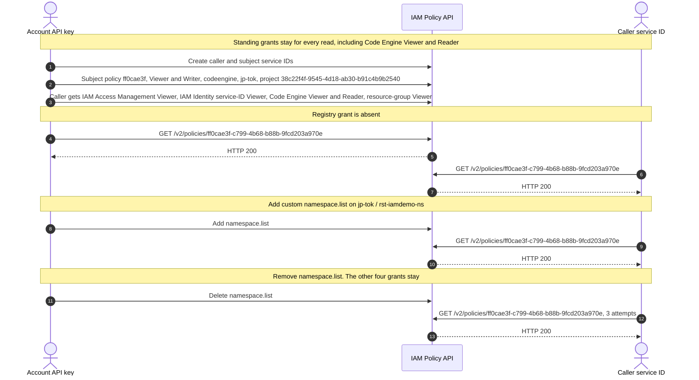
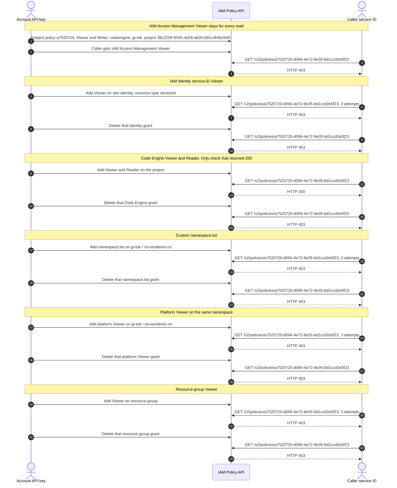

# IAM policy GET reproduction

The service ID kept returning **403** on `GET /v2/policies/{id}`. The account API key returned **200** on the same policy every time, so the policy exists and the denial is the caller.

The customer report is **403**, then **200**, then **403**, with the only change being a Container Registry grant. That pattern did not show up here. After the caller was given the standing grants from `svc-terraform-ibm`, almost every check stayed **403**. The one read that returned **200** was while the caller had Code Engine **Viewer and Reader** on the same project as the policy. Removing that grant returned **403** again. Custom `namespace.list`, platform Viewer on the registry namespace, IAM Identity service-ID Viewer, and resource-group Viewer did not change the 403.

Terraform provider `IBM-Cloud/ibm` **2.5.0** hits this on refresh of `ibm_iam_service_policy`. Read calls `GetV2Policy(policyID)` in the IAM Policy Management Go SDK. That is `GET https://iam.cloud.ibm.com/v2/policies/{id}`.

The validated project was `38c22f4f-9545-4d18-ab30-b91c4b9b2540` in `jp-tok`. The registry namespace was `rst-iamdemo-ns`. The policy being read was Viewer and Writer on that project, owned by a second service ID.

## Test 1: registry grant on top of the standing set

The caller kept four grants for every read:

- IAM Access Management Viewer
- IAM Identity service-ID Viewer (`iam-identity`, `resourceType=serviceid`)
- Code Engine Viewer and Reader on the project
- Resource-group Viewer on every resource group

Custom `namespace.list` (`container-registry.namespace.list` on `jp-tok` / `rst-iamdemo-ns`) was absent, then added, then removed. Policy `ff0cae3f-c799-4b68-b88b-9fcd203a970e`. Because Code Engine Viewer and Reader was already present, this run never saw a 403.

| Phase | Service ID |
| --- | --- |
| Registry grant absent | **200** |
| `namespace.list` added | **200** |
| `namespace.list` removed, three reads | **200** |



## Test 2: one extra grant at a time

IAM Access Management Viewer stayed on the caller. Each other grant was added, read, and removed before the next one. Policy `a7520720-d094-4e72-9e35-bd1ccd2e0f23`. The service ID was **403** on every check except the Code Engine pair.

| Extra grant | While present | After removal |
| --- | --- | --- |
| None. IAM Access Management Viewer only | 403 |  |
| IAM Identity service-ID Viewer | 403 | 403 |
| Code Engine Viewer and Reader on the project | **200** | **403** |
| Custom `namespace.list` on `jp-tok` / `rst-iamdemo-ns` | 403 | 403 |
| Platform Viewer on that namespace | 403 | 403 |
| Resource-group Viewer | 403 | 403 |



The account API key was **200** on every phase above. Each **200** body was still `serviceName=codeengine`.

An earlier three-phase check, with only IAM Access Management Viewer plus platform Viewer on a registry namespace, also stayed **403**, **403**, **403**.

## Policy shape

The Code Engine policy matches this resource. `iam_service_id` is `ibm_iam_service_id.subject.id`, not `iam_id`.

```hcl
resource "ibm_iam_service_policy" "subject_codeengine" {
  iam_service_id = ibm_iam_service_id.subject.id
  roles          = ["Viewer", "Writer"]

  resources {
    service              = "codeengine"
    region               = "jp-tok"
    resource_instance_id = "38c22f4f-9545-4d18-ab30-b91c4b9b2540"
  }
}
```

Provider 2.5.0 stores that as `serviceName=codeengine`, `region=jp-tok`, and `serviceInstance=38c22f4f-9545-4d18-ab30-b91c4b9b2540`. Python asks IAM for the Code Engine role list and uses the CRNs returned for the display names Viewer and Writer. The customer resource that started this work used project `353e8ce5-42e6-49b6-b1b2-b7f1feff343a`.

The earlier three-phase registry grant is platform Viewer on the caller. The 5 October checks also used custom `namespace.list` on `rst-iamdemo-ns`:

```hcl
resources {
  service       = "container-registry"
  region        = "jp-tok"
  resource_type = "namespace"
  resource      = "rst-iamdemo-ns"
}
```

The project GUID and namespace are IAM attributes. This test does not create the Code Engine project or the Container Registry namespace. The caller and the policy subject are two different service IDs. IAM Access Management Viewer remains on the caller for all three reads.

## Credentials

Export an API key that can create service IDs and access policies. The Terraform script sets both `IC_API_KEY` and `IBMCLOUD_API_KEY` to the caller key before each refresh, then restores the account key for create and delete.

```bash
export IBMCLOUD_API_KEY="..."
```

Optional overrides:

```bash
export REGISTRY_NAMESPACE="dreamvu-data-mover"
export REGISTRY_REGION="jp-tok"
export CODEENGINE_PROJECT_ID="353e8ce5-42e6-49b6-b1b2-b7f1feff343a"
export CODEENGINE_REGION="jp-tok"
export WAIT_SECONDS=45
```

State, the caller API key, and provider logs are gitignored.

## Terraform, provider 2.5.0

`terraform/admin` creates both service IDs, the caller API key, the IAM Access Management Viewer policy, and the project-scoped Code Engine policy. `grant_registry_viewer` adds or removes the registry policy.

`terraform/refresh` contains only `ibm_iam_service_policy.codeengine`, using `iam_service_id`. An administrator imports it, then each phase runs `terraform plan -refresh-only` as the caller. That plan calls Read and does not create or update the policy.

```bash
scripts/terraform_repro.sh
scripts/terraform_repro.sh cleanup
```

Provider debug is written to `out/<phase>.log` with `Authorization` redacted. Refresh exit codes:

- `1` — Read failed. For this test that is the 403.
- `0` — `GetV2Policy` succeeded and the policy still matches the config.
- `2` — Read succeeded, and Terraform wants to change the resource. Check the log before treating that as the reported behavior.

A run that matches the report is exit `1`, then `0`, then `1`.

## Python SDK

The client is `ibm-platform-services` (`IamPolicyManagementV1`), on `ibm-cloud-sdk-core`. Setup calls v1 `create_policy`, the same create path provider 2.5.0 uses when the policy has no rule conditions. Each probe calls `get_v2_policy`.

```bash
python3 -m venv .venv
source .venv/bin/activate
pip install -r python/requirements.txt
python python/reproduce_policy_get.py run --brief \
  --codeengine-project-id 353e8ce5-42e6-49b6-b1b2-b7f1feff343a \
  --registry-namespace dreamvu-data-mover
python python/reproduce_policy_get.py cleanup
```

`run` waits `--initial-wait` seconds (default 20), then reads the policy with the account API key and with the caller service ID. A service ID read stops after 3 attempts. `--brief` prints a short result. The account API key is cyan. The service ID is yellow. Omit `--brief` to print the HTTP request and response, with API keys and bearer tokens redacted.

Exit `2` means the service ID statuses were 403, then 200, then 403. Exit `0` means those statuses were different and the account key read the policy in every phase. Exit `1` means the account key did not get HTTP 200 in every phase. Caller credentials are stored in `python/out/state.json`.

## What the checks showed

The caller service ID stayed **403** for IAM Access Management Viewer alone, IAM Identity service-ID Viewer, custom `namespace.list`, platform Container Registry Viewer, and resource-group Viewer. The registry add/remove in the first test did not produce a 403, because Code Engine Viewer and Reader was already on the caller and that read was already **200**.

The customer pattern, **403** then **200** then **403** as the registry grant comes and goes, was not reproduced. The grant that changed the read in this account was Code Engine Viewer and Reader on project `38c22f4f-9545-4d18-ab30-b91c4b9b2540`.
