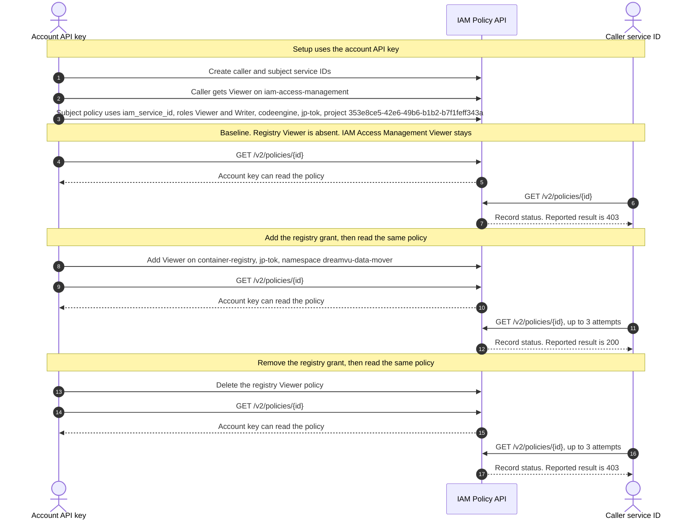

# IAM policy GET reproduction

Please review this flow and confirm it is the path that returns the error.

A caller service ID has platform **Viewer** on IAM Access Management for the whole test. A second service ID owns a **Viewer + Writer** policy scoped to one Code Engine project. The test reads that policy with `GET /v2/policies/{id}` three times:

1. Registry Viewer is absent.
2. Platform Viewer is added on one Container Registry namespace.
3. That registry grant is removed.

The policy ID does not change. Only the caller's registry grant changes. The reported result is **403**, then **200**, then **403**. In this account the caller service ID stayed **403** in all three phases. The account API key could read the same policy throughout.

Terraform provider `IBM-Cloud/ibm` **2.5.0** hits this on refresh of `ibm_iam_service_policy`. Read calls `GetV2Policy(policyID)` in the IAM Policy Management Go SDK. That is `GET https://iam.cloud.ibm.com/v2/policies/{id}`.

## Flow to confirm

| Phase | Caller grants | Policy being read |
| --- | --- | --- |
| Baseline | Viewer on `iam-access-management` | Viewer and Writer on one Code Engine project |
| With registry | Baseline plus Viewer on `container-registry`, `jp-tok`, namespace `dreamvu-data-mover` | Same Code Engine policy |
| After revoke | Baseline only | Same Code Engine policy |



Python prints both reads on every phase. Terraform `plan -refresh-only` runs only the caller read. The account-key read in Terraform is the import of `ibm_iam_service_policy`.

## Policy shape

The Code Engine policy matches this resource. `iam_service_id` is `ibm_iam_service_id.subject.id`, not `iam_id`.

```hcl
resource "ibm_iam_service_policy" "subject_codeengine" {
  iam_service_id = ibm_iam_service_id.subject.id
  roles          = ["Viewer", "Writer"]

  resources {
    service              = "codeengine"
    region               = "jp-tok"
    resource_instance_id = "353e8ce5-42e6-49b6-b1b2-b7f1feff343a"
  }
}
```

Provider 2.5.0 stores that as `serviceName=codeengine`, `region=jp-tok`, and `serviceInstance=353e8ce5-42e6-49b6-b1b2-b7f1feff343a`. Python asks IAM for the Code Engine role list and uses the CRNs returned for the display names Viewer and Writer.

The registry grant, present only in the middle phase, is platform Viewer on the caller:

```hcl
resources {
  service       = "container-registry"
  region        = "jp-tok"
  resource_type = "namespace"
  resource      = "dreamvu-data-mover"
}
```

The project GUID and namespace are IAM attributes. This test does not create the Code Engine project or the Container Registry namespace. The caller and the policy subject are two different service IDs. IAM Access Management Viewer remains on the caller for all three reads.

## Credentials

Export an API key that can create service IDs and access policies. The Terraform script sets both `IC_API_KEY` and `IBMCLOUD_API_KEY` to the caller key before each refresh, then restores the account key for create and delete.

```bash
export IBMCLOUD_API_KEY="..."
```

Optional overrides:

```bash
export REGISTRY_NAMESPACE="dreamvu-data-mover"
export REGISTRY_REGION="jp-tok"
export CODEENGINE_PROJECT_ID="353e8ce5-42e6-49b6-b1b2-b7f1feff343a"
export CODEENGINE_REGION="jp-tok"
export WAIT_SECONDS=45
```

State, the caller API key, and provider logs are gitignored.

## Terraform, provider 2.5.0

`terraform/admin` creates both service IDs, the caller API key, the IAM Access Management Viewer policy, and the project-scoped Code Engine policy. `grant_registry_viewer` adds or removes the registry policy.

`terraform/refresh` contains only `ibm_iam_service_policy.codeengine`, using `iam_service_id`. An administrator imports it, then each phase runs `terraform plan -refresh-only` as the caller. That plan calls Read and does not create or update the policy.

```bash
scripts/terraform_repro.sh
scripts/terraform_repro.sh cleanup
```

Provider debug is written to `out/<phase>.log` with `Authorization` redacted. Refresh exit codes:

- `1` — Read failed. For this test that is the 403.
- `0` — `GetV2Policy` succeeded and the policy still matches the config.
- `2` — Read succeeded, and Terraform wants to change the resource. Check the log before treating that as the reported behavior.

A run that matches the report is exit `1`, then `0`, then `1`.

## Python SDK

The client is `ibm-platform-services` (`IamPolicyManagementV1`), on `ibm-cloud-sdk-core`. Setup calls v1 `create_policy`, the same create path provider 2.5.0 uses when the policy has no rule conditions. Each probe calls `get_v2_policy`.

```bash
python3 -m venv .venv
source .venv/bin/activate
pip install -r python/requirements.txt
python python/reproduce_policy_get.py run --brief \
  --codeengine-project-id 353e8ce5-42e6-49b6-b1b2-b7f1feff343a \
  --registry-namespace dreamvu-data-mover
python python/reproduce_policy_get.py cleanup
```

`run` waits `--initial-wait` seconds (default 20), then reads the policy with the account API key and with the caller service ID. A service ID read stops after 3 attempts. `--brief` prints a short result. The account API key is cyan. The service ID is yellow. Omit `--brief` to print the HTTP request and response, with API keys and bearer tokens redacted.

Exit `2` means the service ID statuses were 403, then 200, then 403. Exit `0` means those statuses were different and the account key read the policy in every phase. Exit `1` means the account key did not get HTTP 200 in every phase. Caller credentials are stored in `python/out/state.json`.

## What a match would show

On the middle phase the response body would still be the Code Engine project policy. The registry grant would not retarget it. Only the caller service ID's ability to read it would change. That change did not occur in this account: the service ID read stayed denied after the registry Viewer grant was added and after it was removed.
